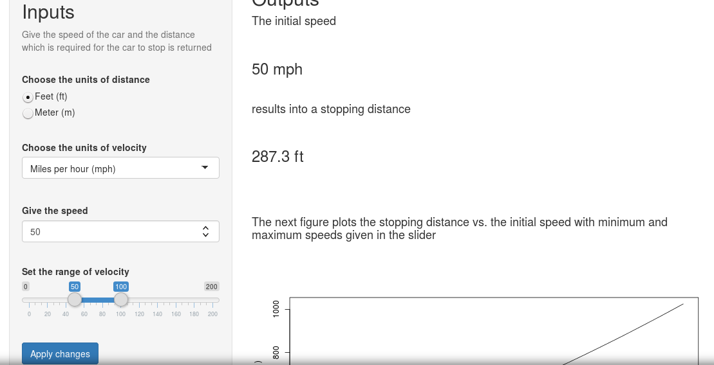

## Car stopping distance

You are driving a car among the other cars.

It might be a rush hour.

How close is it safe to drive behind the car that is ahead of you?

Car stopping distance application tells you the safe distance.

Insert the units of speed, miles or kilometers per hour, and units of distance, feet or meter.

Put into the numeric input the speed you want the answer for and the application gives the distance.

Application can be found in

https://dataaj73.shinyapps.io/carstop-app

and the next page contains a screenshot of the application

---



---

## Application

The left panel contains all the inputs and the right panel all the outputs. The application uses a model

$$Distance = \alpha * Speed + \beta * Speed^2$$

and the R dataset "cars" in order to produce the prediction for the stopping distance.

As an example we calculate the stopping distance with initial velocity 50 miles per hour

```{r}
speed <- cars$speed
speed_sq <- speed^2
dist <- cars$dist
modelFit <- lm(dist ~ speed + speed_sq - 1)
est <- data.frame(speed = 50, speed_sq = 50^2)
round(predict(modelFit, est), 2)
```

---

## Application

Furthermore the application contains a figure that shows how the stopping distance develops with increasing speed.

You can choose the range of the plot with slider inputs.


Improve the safety of your driving with the car stopping distance application.

An easy way to reduce your risks in driving!
